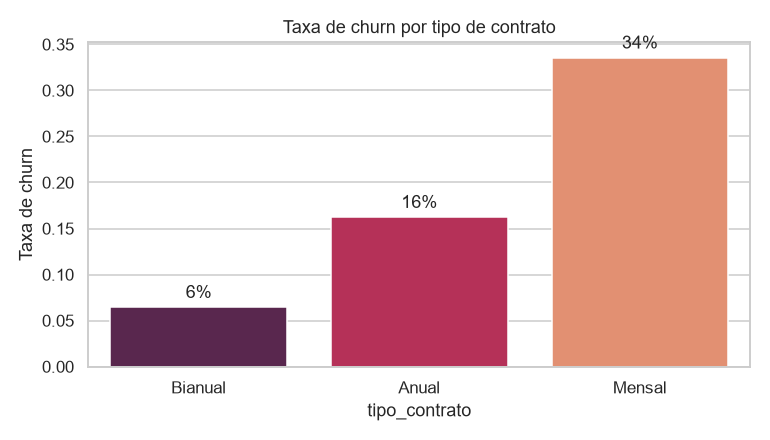
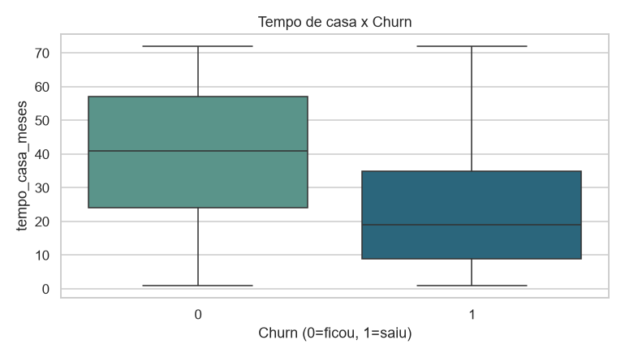
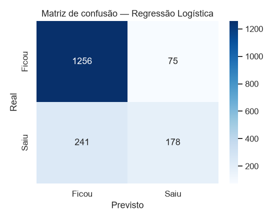
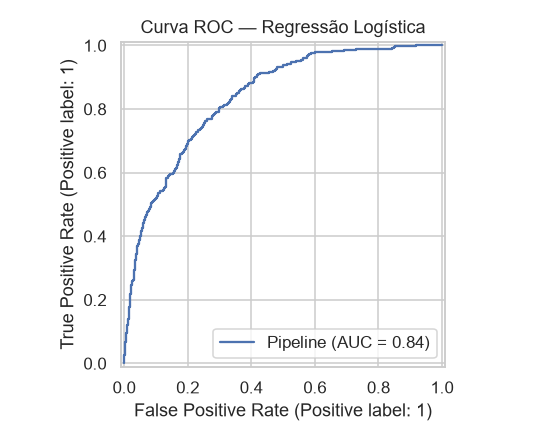
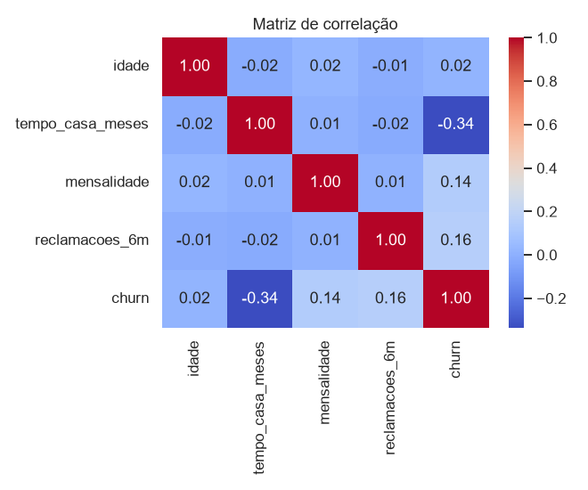

# 📉 Previsão de Churn em Telecom

Projeto de **Ciência de Dados** que prevê quais clientes de uma operadora de
telecom têm maior risco de cancelar o serviço (*churn*). Cobre o ciclo completo:
geração de dados, análise exploratória, modelagem e avaliação.

> Vaga alvo: **Cientista de Dados Júnior**

## 🎯 Problema de negócio
Reter um cliente custa muito menos do que conquistar um novo. Ao identificar com
antecedência quem tem alto risco de churn, a empresa pode agir (ofertas, suporte
proativo) antes da perda.

## 🧰 Stack
`Python` · `pandas` · `scikit-learn` · `matplotlib` · `seaborn`

## 📁 Estrutura
```
1-churn-telecom/
├── src/
│   ├── 01_gerar_dados.py     # gera dataset sintético reprodutível (semente fixa)
│   ├── 02_analise_eda.py     # análise exploratória + gráficos
│   └── 03_modelagem.py       # Regressão Logística vs Random Forest
├── dados/                    # CSV gerado
├── imagens/                  # gráficos gerados
└── requirements.txt
```

## ▶️ Como rodar
```bash
pip install -r requirements.txt
python src/01_gerar_dados.py
python src/02_analise_eda.py
python src/03_modelagem.py
```

## 🔎 Abordagem
1. **Dados**: 7.000 clientes sintéticos com variáveis de contrato, uso e
   reclamações. A relação com o churn segue uma regra latente + ruído.
2. **EDA**: distribuição de churn por contrato, tempo de casa e correlações.
3. **Modelagem**: pipeline com `ColumnTransformer` (padronização + one-hot),
   comparando Regressão Logística e Random Forest, avaliados por **AUC-ROC**,
   precisão/recall e matriz de confusão.

## 📊 Principais resultados
- Contrato **mensal** e **reclamações recentes** são os maiores indicadores de churn.
- Clientes com mais **tempo de casa** cancelam bem menos.
- O melhor modelo (Regressão Logística) alcança **AUC ≈ 0.84** no conjunto de teste.

## 🖼️ Resultados visuais

| Churn por contrato | Tempo de casa x Churn |
|---|---|
|  |  |

| Matriz de confusão | Curva ROC |
|---|---|
|  |  |



## 💡 Próximos passos
- Ajuste de threshold conforme custo de falso negativo.
- Explicabilidade com SHAP.
- Deploy do modelo como API.

## 📓 Notebook

Versão em Jupyter Notebook (já executada, com saídas e gráficos): [`notebook.ipynb`](notebook.ipynb).
